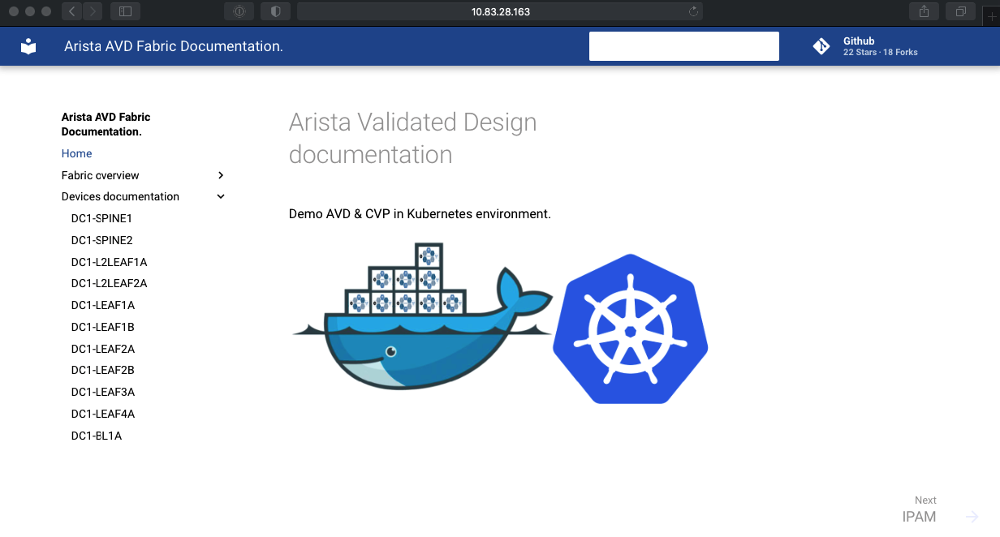

# Automate AVD deployment

__DISCLAIMER__: This repository is a proof of concept and self-training repository.

- [Automate AVD deployment](#automate-avd-deployment)
  - [About](#about)
  - [Generic overview](#generic-overview)
  - [Docker image](#docker-image)
    - [Entrypoint](#entrypoint)
      - [Manual Testing](#manual-testing)
      - [Automatic Testing](#automatic-testing)
  - [Automate using docker-compose](#automate-using-docker-compose)
  - [Automate using Kubernetes](#automate-using-kubernetes)
    - [POD definition](#pod-definition)
    - [Service definition](#service-definition)
  - [License](#license)

## About

This repository provides a Proof of concept of how to use [__docker-compose__](https://docs.docker.com/compose/) or [kubernetes](https://kubernetes.io/) to automate [Arista Validated Design](https://github.com/aristanetworks/ansible-avd) deployment.

Arista Validated Design is an ansible collection to build and deploy EVPN/VXLAN fabric using either EOS eAPI or Cloudvision based on recommended design. In addition to device configuration, project builds devices and network documentation. So here we will go through different ways to :

- Build configuration
- Apply configuration (optional)
- Expose documentation using a web server.

<p align="center">
  
</p>

## Generic overview

Generic workflow is to have a specific git repository where all the configuration elements are available. It means this repository does not focus on how to manage AVD, but how we can leverage docker-compose or kubernetes to completely automate deployment.

In this demo, we will use [this demo repository](https://github.com/titom73/ansible-avd-cloudvision-demo) to provide AVD content. This repository comes with a [single playbook](https://github.com/titom73/ansible-avd-cloudvision-demo/blob/master/dc1-fabric-deploy-cvp.yml) to generate and deploy based on ansible tags (build / generate). Some other contents are also part of the repository as it is a dedicated demo, but in our case, we will only focus on container deployment to publish configuration and documentation.

## Docker image

Both docker-compose and kubernetes will consume a docker image which is built from this repository. This [docker image](docker/avd/Dockerfile) is based on `avdteam/base:3.6` image and add an extra entrypoint to automate following tasks:

- Clone content repository locally
- Install additional Python requirements
- Install last version of [`arista.cvp`](https://github.com/aristanetworks/ansible-cvp) and [`arista.avd`](https://github.com/aristanetworks/ansible-avd) collections
- Check sanity of playbook to run
- Execute playbook
- Publish web content to `/web/` folder

To build this image, you can run commands:

```shell
$ cd docker

# A prebuilt Makefile is available
$ make build
```

This command will generate an image named: `titom73/k8s_avd:0.0.1`. if you want to change the name, run command with following option:

```shell
$ make DOCKER_BASE=test DOCKER_NAME=container build
```

### Entrypoint

Entrypoint is configured to run with 3 custom variables:

- `REPO_AVD_DATA`: URL of the repository to use as source of information.
- `ANSIBLE_PLAYBOOK`: Playbook available in `${REPO_AVD_DATA}` to run for provisioning.
- `ANSIBLE_TAGS`: Ansible tags to use with playbook.
  - build: just generate configuration and documentation and expose content on a webserver
  - deploy: same as `build` + provision content on Cloudvision.

#### Manual Testing

To test entrypoint, you can connect to a container with following command:

```shell
make exec
Agent pid 47
➜  /projects
```

If you want to customize content, manually run and update variables to your needs

```shell
docker run --rm -it \
		-e REPO_AVD_DATA='https://github.com/titom73/avd-for-compose-kubernetes-demo.git' \
		-e ANSIBLE_PLAYBOOK='dc1-fabric-deploy-cvp.yml' \
		-e ANSIBLE_TAGS='build' \
		-v /etc/hosts:/etc/hosts titom73/k8s_avd:0.0.1 zsh
Agent pid 47
➜  /projects
```

#### Automatic Testing

To run entrypoint at login, just run:

```shell
$ make run

REPO_AVD_DATA is set from outside with: https://github.com/titom73/avd-for-compose-kubernetes-demo.git
Cloning repository ...
Cloning into '.'...
remote: Enumerating objects: 533, done.
remote: Counting objects: 100% (533/533), done.
remote: Compressing objects: 100% (263/263), done.
[...]
```

If you want to customize content, manually run and update variables to your needs

```shell
docker run --rm -it \
		-e REPO_AVD_DATA='https://github.com/titom73/avd-for-compose-kubernetes-demo.git' \
		-e ANSIBLE_PLAYBOOK='dc1-fabric-deploy-cvp.yml' \
		-e ANSIBLE_TAGS='build' \
		-v /etc/hosts:/etc/hosts titom73/k8s_avd:0.0.1
REPO_AVD_DATA is set from outside with: https://github.com/titom73/avd-for-compose-kubernetes-demo.git
Cloning repository ...
Cloning into '.'...
remote: Enumerating objects: 533, done.
remote: Counting objects: 100% (533/533), done.
remote: Compressing objects: 100% (263/263), done.
[...]
```

## Automate using docker-compose

First scenario is to use a docker-compose file to run 2 different containers:

- one container to run AVD
- one container to expose documentation using web server

Image for AVD is built on the fly using image described in previous section whereas for web server, we just use a basic NGINX image. On top of that, we have to set variables for AVD runner, expose web server outside of this stack and then share a volume between containers to expose documentation content.

```yaml
version: '3'
volumes:
  avd_volume:
    driver: local

services:
  avd-builder:
    build: '../docker/avd/'
    environment:
      - REPO_AVD_DATA=https://github.com/titom73/avd-for-compose-kubernetes-demo.git
      - ANSIBLE_PLAYBOOK='dc1-fabric-deploy-cvp.yml'
      - ANSIBLE_TAGS='build'
    volumes:
      - avd_volume:/web
  avd-web:
    image: "nginx"
    ports:
      - "8080:80"
    volumes:
      - avd_volume:/usr/share/nginx/html/
```

To run this stack, just run commands:

```shell
cd docker-compose

# Bring up docker-compose stack
$ docker-compose -f docker-compose.yml up -d
Creating network "docker_compose_default" with the default driver
Creating docker_compose_avd-builder_1 ... done
Creating docker_compose_avd-web_1     ... done

# Check containers:
$ docker-compose ps
            Name                          Command               State          Ports
--------------------------------------------------------------------------------------------
docker_compose_avd-builder_1   /bin/bash -c /root/entrypo ...   Up
docker_compose_avd-web_1       nginx -g daemon off;             Up      0.0.0.0:8080->80/tcp
```

You can check AVD runner execution with command:

```shell
docker logs docker_compose_avd-builder_1
REPO_AVD_DATA is set from outside with: https://github.com/titom73/avd-for-compose-kubernetes-demo.git
Cloning repository ...
Cloning into '.'...
Found additional requirements, installing ...
[...]
```

When ready, content will be available on http://127.0.0.1:8080



## Automate using Kubernetes

In this section, we will see how to consume worklfow above in a Kubernetes cluster. To achieve this phase, we have to use image built in this [section](#docker-image) meaning it has to be on a docker registry.

### POD definition

This demo has been built using a Microk8s instance.

We have to define a POD to list all containers to run for this service:

- POD Name: `avd-documentation`
- avd-runner: `titom73/k8s_avd:0.0.1`
- Web server: NGINX
- Shared volume: `avd-data`

```yaml
---
apiVersion: v1
kind: Pod
metadata:
  name: avd-documentation
  labels:
    name: avd-documentation
    run: avd-web
    app: nginx
    version: '0.0.2'
spec:
  restartPolicy: OnFailure
  volumes:
  - name: avd-data
    emptyDir: {}
  containers:
  - name: avd-web
    image: nginx
    ports:
      - containerPort: 80
        protocol: TCP
    command: ['nginx-debug', '-g', 'daemon off;']
    volumeMounts:
      - name: avd-data
        mountPath: /usr/share/nginx/html/
  - name: avd-builder
    image: titom73/k8s_avd:0.0.2
    env:
      - name: REPO_AVD_DATA
        value: "https://github.com/titom73/ansible-avd-cloudvision-demo.git"
      - name: ANSIBLE_PLAYBOOK
        value: "dc1-fabric-deploy-cvp.yml"
      - name: ANSIBLE_TAGS
        value: "build"
    volumeMounts:
      - name: avd-data
        mountPath: /web/
    imagePullPolicy: Always
```

You can first run this POD with the following command:

```shell
$ kubectl apply -f k8s/k8s-pod-avd.yml
pod/avd-documentation created
```


Using CLI, you can also check POD execution

```shell
# Get list of PODs
$ kubectl get pod
NAME                READY   STATUS    RESTARTS   AGE
avd-documentation   2/2     Running   0          98s

# Get information about the POD
$ kubectl describe pod avd-documentation
Name:         avd-documentation
Namespace:    default
Priority:     0
Node:         k8s-microk8s-ubuntu-snap/10.73.1.244
Start Time:   Mon, 04 May 2020 19:40:57 +0200
Labels:       app=nginx
              name=avd-documentation
              run=avd-web
              version=0.0.1

Status:       Running
IP:           10.1.41.188
[... output truncated ...]
```

You can also connect to Ansible runner using the following command:

```shell
demo-avd-compose-k8s on master [✘!?]
➜ kubectl exec -it avd-documentation -c avd-builder -- zsh

Agent pid 1602
➜  /projects git:(master) ✗
➜  /projects git:(master) ✗ ls
LICENSE    ansible-cvp  dc1-fabric-deploy-cvp.yml  dc1-ztp-configuration.yml  intended       repository-cleanup.sh  site
Makefile   ansible.cfg  dc1-fabric-reset-cvp.yml   documentation              inventory.yml  requirements.txt
README.md  data         dc1-upload-configlets.yml  group_vars                 mkdocs.yml     roles
```

### Service definition

Now we have to expose NGINX to access to our documentation. As we are on a small cluster on premise, we are using `NodePort` to access to POD. It is configure to be a static port set to 31080 (`nodePort: 31080`)

```yaml
---
apiVersion: v1
kind: Service
metadata:
  name: avd-documentation-service
spec:
  type: NodePort
  ports:
  - nodePort: 31080
    port: 80
    targetPort: 80
  selector:
    run: avd-web
    app: nginx
```

To configure this service, just run command:

```shell
# Expose AVD documentation
$ kubectl apply -f k8s/k8s-service-node.yml
service/avd-documentation-service created

# Check service
$ kubectl get services
NAME                        TYPE           CLUSTER-IP       EXTERNAL-IP   PORT(S)          AGE
avd-documentation-service   NodePort       10.152.183.218   <none>        80:31080/TCP     27s
kubernetes                  ClusterIP      10.152.183.1     <none>        443/TCP          8d
web-service                 NodePort       10.152.183.26    <none>        8080:31081/TCP   27h
```

And finally, you can access to your POD documentation using POD ip address and listening port (`31080`):


## License

Project is published under [BSD License](./LICENSE)